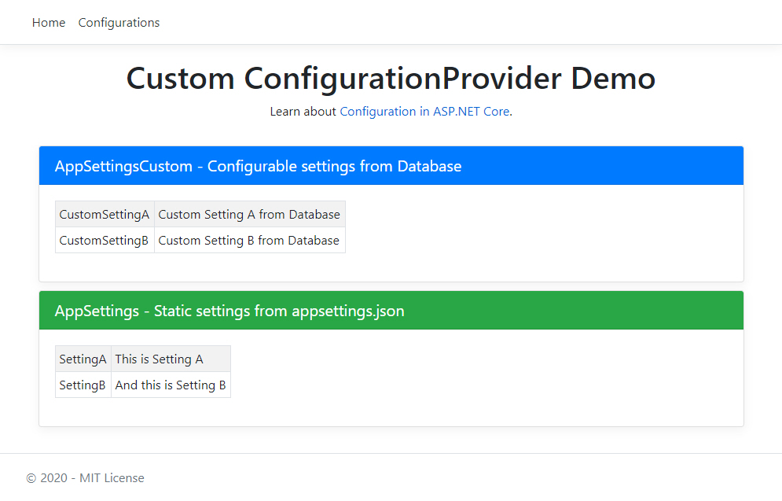

# Custom ConfigurationProvider Demo

Working with .NET Core is a pure pleasure. The framework architecture is modular, pluggable, and highly extensible. Configuration is a good examples of this.
It lets you aggregate many configuration values from multiple different sources, and then access those in a strongly typed fashion using the **IOptions<>** pattern.

I want to use configuration section from the **appsettings.json** which can be set from the UI as well. Configuration section values are stored in the database and exposed through a **Entity Framework Core DbContext**.

## Getting started
ASP.NET Core templates call CreateDefaultBuilder when building a **WebHost**. This provides default configuration for the application, for instance the **appsettings.json** using the File Configuration Provider:

```csharp
public static IWebHostBuilder CreateWebHostBuilder(string[] args) =>
    WebHost.CreateDefaultBuilder(args)
        .ConfigureAppConfiguration((hostingContext, config) =>
        {
            var env = hostingContext.HostingEnvironment;
            config.Sources.Clear();
            config.SetBasePath(env.ContentRootPath);
            config.AddJsonFile("appsettings.json", optional: false, reloadOnChange: true);
            config.AddJsonFile($"appsettings.{env.EnvironmentName}.json", optional: true, reloadOnChange: true);
            config.AddEnvironmentVariables();
            // Rebuild configuration
            var configuration = config.Build();
            var sqlServerOptions = configuration.GetSection(nameof(SqlServerOptions));
            config.Add(new AppSettingsCustomEntityConfigurationSource(configuration)
            {
                OptionsAction = options => options.UseSqlite(sqlServerOptions[nameof(SqlServerOptions.SqlServerConnection)]),
                //OptionsAction = options => options.UseInMemoryDatabase("db", new InMemoryDatabaseRoot())),
                ReloadOnChange = true
            });
        })
        .UseContentRoot(Directory.GetCurrentDirectory())
        // Because we are accessing a Scoped service via the IOptionsSnapshot provider,
        // we must disable the dependency injection scope validation feature:
        .UseDefaultServiceProvider(options => options.ValidateScopes = false)
        .UseStartup<Startup>()
        .UseSerilog((hostingContext, loggerConfiguration) => loggerConfiguration
            .ReadFrom.Configuration(hostingContext.Configuration)
            .Enrich.FromLogContext());
```
We will use two configuration classes: **AppSettings** and **AppSettingsCustom**.
Both maps to the configuration section in **appsettings.json**. But only **AppSettingsCustom** class overrides of those configuration values from the database (**AppSettingsCustomEntity**).

```csharp
public class AppSettingsCustom : IAppSettingsCustom
{
    public string CustomSettingA { get; set; }

    public string CustomSettingB { get; set; }
}
```

```csharp
[Table("AppCustomSettings")]
public class AppSettingsCustomEntity
{
    [Key]
    [DatabaseGenerated(DatabaseGeneratedOption.Identity)]
    public int Id { get; set; }

    [Description("CustomSetting A")]
    [Column("CustomSettingA", TypeName = "nvarchar(512)")]
    public string CustomSettingA { get; set; }

    [Description("CustomSetting B")]
    [Column("CustomSettingB", TypeName = "nvarchar(512)")]
    public string CustomSettingB { get; set; }

    [Column("Default", TypeName = "bit")]
    public bool Default { get; set; } = true;
}    
```

The configuration file **appsettings.json** look like this:

```json
{
  "AppSettings": {
    "SettingA": "This is Setting A",
    "SettingB": "And this is Setting B"
  },
  "AppSettingsCustom": {
    "CustomSettingA": "Custom Setting A",
    "CustomSettingB": "Custom Setting B"
  }
}
```

## Creating a custom configuration provider

In order to create a custom configuration provider, we have to implement the **IConfigurationProvider** and **IConfigurationSource** interfaces from the **Microsoft.Extensions.Configuration.Abstractions** Nuget package.

We override the Load method with custom implementation, this method loads (or reloads) the data for the configuration provider. Here we instantiate the DbContext using the **OptionsAction** from the configuration source. Then we get a **AppSettingsCustomEntity** from the database and set its values to the configuration dictionary of the configuration provider.
And by using the same keys for the configuration values as we used in the **appsettings.json** we will override those values with the values from the database.

```csharp
public class AppSettingsCustomEntityConfigurationProvider : ConfigurationProvider
{
    private readonly AppSettingsCustomEntityConfigurationSource _source;

    public AppSettingsCustomEntityConfigurationProvider(AppSettingsCustomEntityConfigurationSource source)
    {
        _source = source;
        if (_source.ReloadOnChange)
        {
            EntityChangeObserver.Instance.Changed += EntityChangeObserverChanged;
        }
    }

    public override void Load()
    {
        var builder = new DbContextOptionsBuilder<DatabaseContext>();
        _source.OptionsAction(builder);
        var context = new DatabaseContext(builder.Options);
        try
        {
            // Update AppSettingsCustom Data 
            // Configuration consists of a hierarchical list of name-value pairs in which the nodes are separated by a colon (:)
            // Read more: https://www.paraesthesia.com/archive/2018/06/20/microsoft-extensions-configuration-deep-dive/
            Data = new Dictionary<string, string>(StringComparer.OrdinalIgnoreCase);

            // Ensure database is created
            context.Database.EnsureCreated();

            // Read default configuration from Data table
            var config = context.AppSettingsCustomItems.FirstOrDefault(cfg => cfg.Default == true);
            if (config == null)
            {
                // Note: if there is no available configuration in the database then we read values from appsettings.json file
                Data.Add($"{nameof(AppSettingsCustom)}:{nameof(AppSettingsCustom.CustomSettingA)}", _source.Configuration.GetValue<string>($"{nameof(AppSettingsCustom)}:{nameof(AppSettingsCustom.CustomSettingA)}"));
                Data.Add($"{nameof(AppSettingsCustom)}:{nameof(AppSettingsCustom.CustomSettingB)}", _source.Configuration.GetValue<string>($"{nameof(AppSettingsCustom)}:{nameof(AppSettingsCustom.CustomSettingB)}"));
            }
            else
            {
                if (config.CustomSettingA != null)
                {
                    Data.Add($"{nameof(AppSettingsCustom)}:{nameof(AppSettingsCustom.CustomSettingA)}", config.CustomSettingA);
                }
                if (config.CustomSettingB != null)
                {
                    Data.Add($"{nameof(AppSettingsCustom)}:{nameof(AppSettingsCustom.CustomSettingB)}", config.CustomSettingB);
                }
            }
        }
        catch (Exception ex)
        {
            Log.Error(ex, "Exception occured");
            return;
        }
    }

    private void EntityChangeObserverChanged(object sender, EntityChangeEventArgs e)
    {
        if (e.Entry.Entity.GetType() != typeof(AppSettingsCustomEntity))
        {
            return;
        }
        // Make a small delay to avoid triggering a reload before a change is completely saved to the underlaying database
        Thread.Sleep(_source.ReloadDelay);
        Load();
    }
}
```
We now have a configuration provider that loads its values from the database. But it will only do this once, when the application is started, and we want it to reload as well when the user updates the **AppSettingsCustomEntity** in the database.

## Configuration source
Because we are using Entity Framework Core as a configuration source we need a DbContextOptionsBuilder action to use the DbContext from the configuration provider. We also have a Configuration which we will use in ConfigurationProvider and ReloadDelay to avoid triggering a reload before a change is saved.

```csharp
public class AppSettingsCustomEntityConfigurationSource : IConfigurationSource
{
    public AppSettingsCustomEntityConfigurationSource(IConfiguration configuration)
    {
        Configuration = configuration;
    }

    public IConfiguration Configuration { get; private set; }

    public Action<DbContextOptionsBuilder> OptionsAction { get; set; }

    /// <summary>
    ///     Number of milliseconds that ConfigurationProvider will wait before calling Load method.
    ///     This helps avoid triggering a reload before a change is saved.
    /// </summary>
    public int ReloadDelay { get; set; } = 500;

    public bool ReloadOnChange { get; set; }

    public IConfigurationProvider Build(IConfigurationBuilder builder)
    {
        return new AppSettingsCustomEntityConfigurationProvider(this);
    }
}
```
## Reloading configuration on Entity changes

To trigger a reload of the configuration when the **AppSettingsCustomEntity** has changed, we need to let the configuration provider know that the entity has changed.
This can we do by triggering an event on a entity change observer class and listening for this event in our configuration provider.

```csharp
public class EntityChangeObserver
{
    public event EventHandler<EntityChangeEventArgs> Changed;

    public void OnChanged(EntityChangeEventArgs e)
    {
        ThreadPool.QueueUserWorkItem((_) => Changed?.Invoke(this, e));
    }

    private static readonly Lazy<EntityChangeObserver> lazy = new Lazy<EntityChangeObserver>(() => new EntityChangeObserver());

    private EntityChangeObserver() { }

    public static EntityChangeObserver Instance => lazy.Value;
}
```
## Notify the EntityChangeObserver

Now we have to create a custom base class that extends **DbContext** and override the both **SaveChanges** methods.

```csharp
public class DatabaseContext : DbContext
{
    // Don't remove any of constructors!
    public DatabaseContext()
    {
    }

    public DatabaseContext(DbContextOptions<DatabaseContext> options)
        : base(options)
    {
    }

    public DbSet<AppSettingsCustomEntity> AppSettingsCustomItems{ get; set; }

    public override int SaveChanges()
    {
        TrackEntityChanges();
        return base.SaveChanges();
    }

    public async Task<int> SaveChangesAsync()
    {
        TrackEntityChanges();
        return await base.SaveChangesAsync();
    }

    public override async Task<int> SaveChangesAsync(CancellationToken cancellationToken)
    {
        TrackEntityChanges();
        return await base.SaveChangesAsync(cancellationToken);
    }

    protected override void OnModelCreating(ModelBuilder modelBuilder)
    {
        base.OnModelCreating(modelBuilder);
    }

    private void TrackEntityChanges()
    {
        foreach (var entry in ChangeTracker.Entries().Where(e =>
            e.State == EntityState.Modified || e.State == EntityState.Added || e.State == EntityState.Deleted))
        {
            EntityChangeObserver.Instance.OnChanged(new EntityChangeEventArgs(entry));
        }
    }
}
```

## Trigger a Reload

To let the configuration provider know the entity has changed and to trigger a reload, we need to listen for the **EntityChangeObserver.Instance.Changed** event. And because we only want to reload values when the Entity changes, we add a check to see if that is the type of the **AppSettingsCustomEntity**.

```csharp
public AppSettingsCustomEntityConfigurationProvider(AppSettingsCustomEntityConfigurationSource source)
{
    _source = source;
    if (_source.ReloadOnChange)
    {
        EntityChangeObserver.Instance.Changed += EntityChangeObserverChanged;
    }
}

private void EntityChangeObserverChanged(object sender, EntityChangeEventArgs e)
{
    if (e.Entry.Entity.GetType() != typeof(AppSettingsCustomEntity))
    {
        return;
    }
    // Make a small delay to avoid triggering a reload before a change is saved to the underlaying database
    Thread.Sleep(_source.ReloadDelay);
    Load();
}
```

## Add the ConfigurationSource in the application

As a final step we have to add **AppSettingsCustomEntityConfigurationSource** in the **Program.cs**:

```csharp
 WebHost.CreateDefaultBuilder(args)
    .ConfigureAppConfiguration((hostingContext, config) =>
    {
        var env = hostingContext.HostingEnvironment;
        config.Sources.Clear();
        config.SetBasePath(env.ContentRootPath);
        config.AddJsonFile("appsettings.json", optional: false, reloadOnChange: true);
        config.AddJsonFile($"appsettings.{env.EnvironmentName}.json", optional: true, reloadOnChange: true);
        config.AddEnvironmentVariables();
        // Rebuild configuration
        var configuration = config.Build();
        var sqlServerOptions = configuration.GetSection(nameof(SqlServerOptions));
        config.Add(new AppSettingsCustomEntityConfigurationSource(configuration)
        {
            OptionsAction = options => options.UseSqlite(sqlServerOptions[nameof(SqlServerOptions.SqlServerConnection)]),
            //OptionsAction = options => options.UseInMemoryDatabase("db", new InMemoryDatabaseRoot())),
            ReloadOnChange = true
        });
    })
```
## How it works?

Application at start loads the **AppSettings** and **AppSettingsCustom** options from the **appsettings.json** and then it uses the **AppSettingsCustomEntityConfigurationSource** to override the values (when they are present in the database).
User can add/edit/delete multiple AppSettingsCustom configurations and select default one.
Whenever do this, the **AppSettingsCustomEntity** changes and the values will be reloaded and thrue **IOptionsSnapshot<AppSettingsCustom>** available for all consumers.

**Important:** Use **IOptionsSnapshot<>** which support reloading options. Options are loaded once per request when accessed and cached for the lifetime of the request!
[Read More](https://docs.microsoft.com/en-us/aspnet/core/fundamentals/configuration/options?view=aspnetcore-3.0#reload-configuration-data-with-ioptionssnapshot)

This example demonstrate also the following functionalities:
- [ASP.NET Core 3.1 Razor Pages](https://docs.microsoft.com/en-us/aspnet/core/razor-pages/?view=aspnetcore-3.1&tabs=visual-studio)
- Global Error Handling
- Logging with [Serilog](https://serilog.net/) sink to file
- Asynchronous repository Pattern for Entity types
- [SQLite EF Core Database Provider](https://docs.microsoft.com/en-us/ef/core/providers/sqlite/?tabs=dotnet-core-cli)

## Prerequisites
- [Visual Studio](https://www.visualstudio.com/vs/community) 2019 16.4.5 or greater
- [.NET Core SDK 3.1](https://dotnet.microsoft.com/download/dotnet-core/3.1)

## Tags & Technologies
- [ASP.NET Core 3.1](https://docs.microsoft.com/en-us/aspnet/?view=aspnetcore-3.1#pivot=core)
- [ASP.NET Core 3.1 Razor Pages](https://docs.microsoft.com/en-us/aspnet/core/razor-pages/?view=aspnetcore-3.1&tabs=visual-studio)
- [Entity Framework Core 3.1](https://docs.microsoft.com/en-us/ef/core/)

## Web User interface

For a Web Client we used **ASP.NET Core Razor** Pages which can make coding page-focused scenarios easier and more productive than using controllers and views:



List of available configurations:


Create configuration:


Edit configuration:


Delete configuration:


Enjoy!

## Licence
Licenced under [MIT](http://opensource.org/licenses/mit-license.php).
Contact me on [LinkedIn](https://si.linkedin.com/in/matjazbravc).
